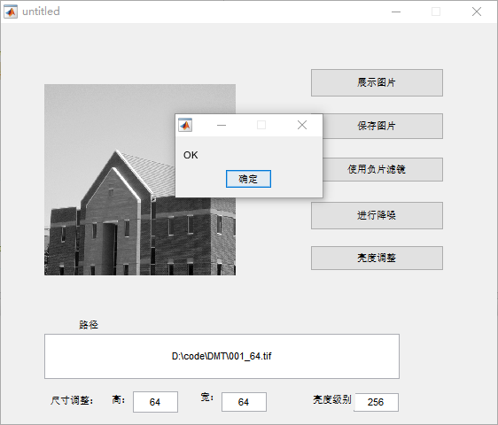
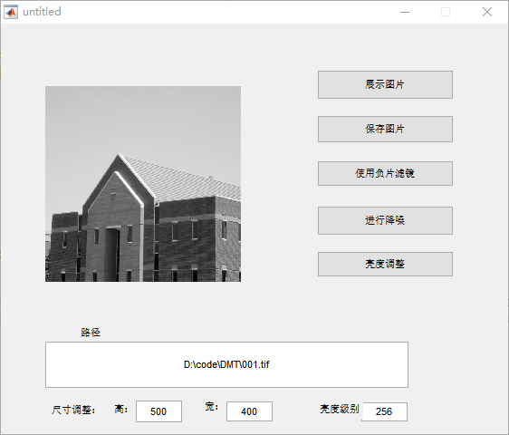
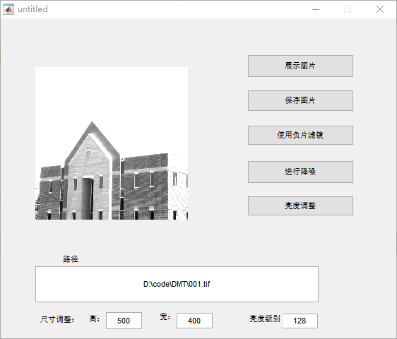
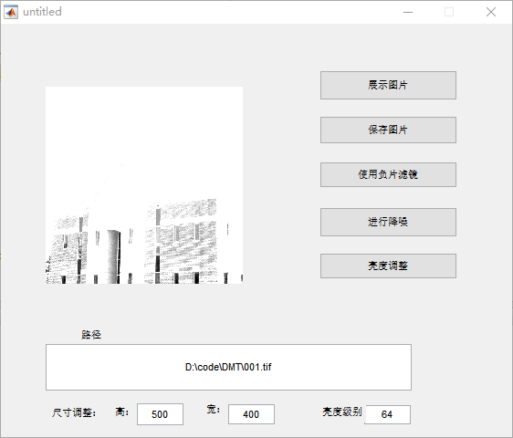
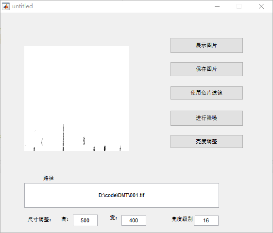
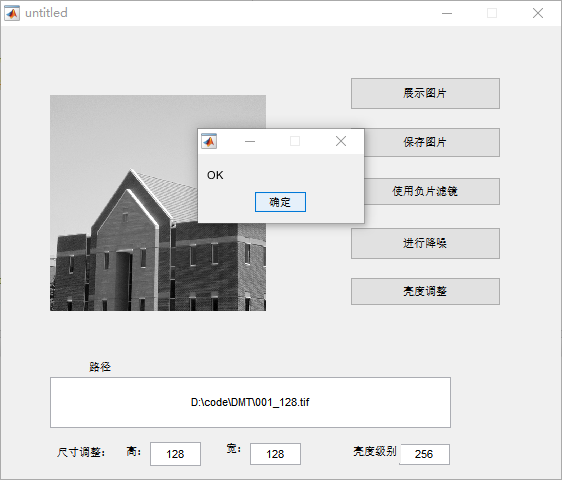
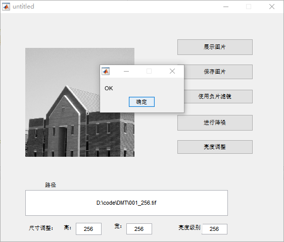
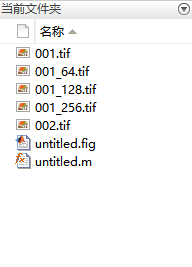

# 数字图像处理实验报告 实验一
在MATLAB command窗口完成以下任务：
##	1. 数字图像资源的加载与显示（imread/imshow）
- GUI显示功能部分代码如下
	```
	function pushbutton1_Callback(hObject, eventdata, handles)
	global pic;
	global path;
	path = get(handles.edit1,'string');
	axes(handles.axes1);
	pic = imread(path);
	imshow(pic);
	```
- GUI存储功能部分代码如下
	```
	function pushbutton2_Callback(hObject, eventdata, handles)
	global pic;
	global path;
	h=str2num(get(handles.edit2,'string'));
	w=str2num(get(handles.edit3,'string'));
	path = get(handles.edit1,'string');
	imwrite(pic,path,'compression','none','resolution',[h,w]);
	msgbox('OK');
	```
- 截图
- 		
##	2. 图像取样与量化实验，请以lena.jpg为例实现64X64、128X128,256X256的取样，分别量化为16、64、128、256级亮度，并把量化后的图像用imwrite写到外部文件中。
- 实现量化亮度功能的部分代码如下
	```
	function pushbutton5_Callback(hObject, eventdata, handles)
	global pic;
	global path;
	path = get(handles.edit1,'string');
	axes(handles.axes1);
	num=str2double(get(handles.edit4,'string'));
	pic = imread(path);
	imshow(pic,[1 num]);
	```
- 截图如下

1. 
2. 
3. 
4. 

		
- 实现取样功能的部分代码如下
	```
	function pushbutton2_Callback(hObject, eventdata, handles)
	global pic;
	global path;
	h=str2num(get(handles.edit2,'string'));
	w=str2num(get(handles.edit3,'string'));
	path = get(handles.edit1,'string');
	imwrite(pic,path,'compression','none','resolution',[h,w]);
	msgbox('OK');
	```
1. 
2. 
3. 
4. 
